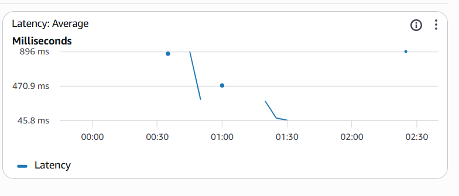

# 🛡️ AWS Serverless GRC & Security Control Center

> 🔗 **Live Demo:** [Consulter le Portail GRC en direct](http://grc-fahd-portal-2026.s3-website.eu-west-3.amazonaws.com)

## 📌 Project Overview
This project demonstrates the implementation of a **100% Serverless** microservices architecture on AWS. It is a Governance, Risk, and Compliance (GRC) portal designed to track security remediation actions, including Pentest findings, Cloud Configuration Audits, and Business Continuity Plans (BCP/PRA).

## 🏗️ Technical Architecture
The application is built using a modern decoupled approach:

* **Frontend:** Web interface hosted on **Amazon S3**.
* **API Layer:** **Amazon API Gateway** (REST API) as a secure entry point.
* **Compute:** 4 **AWS Lambda** functions (Python 3.12) for CRUD logic.
* **Database:** **Amazon DynamoDB** (NoSQL) for high-availability storage.

## 📊 CloudWatch Monitoring & Proof of Work
Native monitoring validates the end-to-end execution of the architecture.

### 📈 Execution Logs (Traffic Volume)
This graph shows the **IncomingLogEvents** for our Lambda functions, proving that requests are correctly routed from the API to the backend.

### ⏱️ Performance (Backend Latency)
This metric confirms an average execution **Latency** of **291ms**, ensuring a fast and responsive GRC dashboard.

## 📂 Repository Structure
* `/frontend`: UI source code (HTML5/JS/CSS).
* `/backend`: Python logic for microservices.
* `/images`: Architecture diagrams and CloudWatch evidence.
* `api-spec.json`: OpenAPI/Swagger definition of the API Gateway.

---
*Project developed as part of the AWS Solutions Architect Certification - 2026.*
